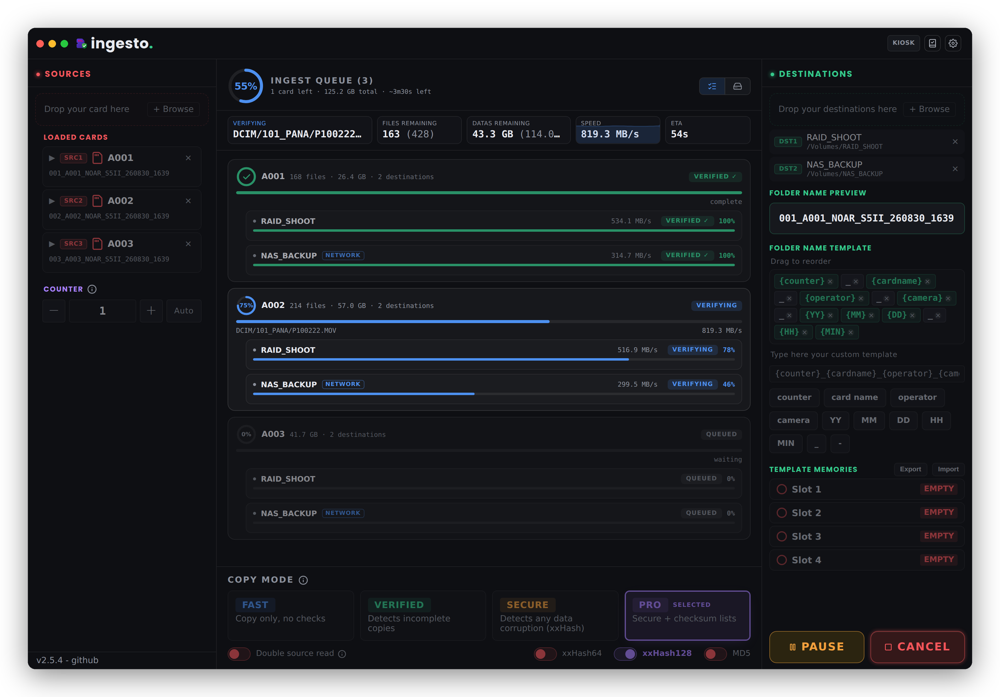
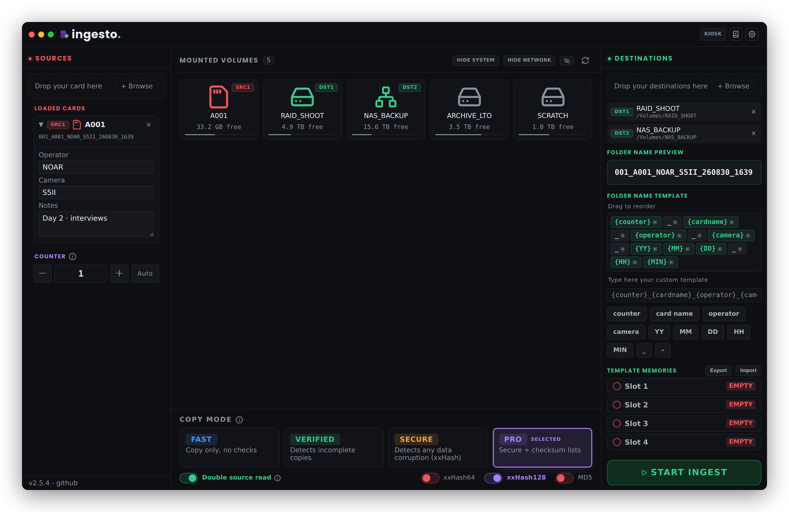
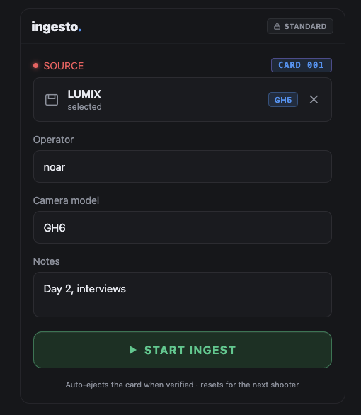
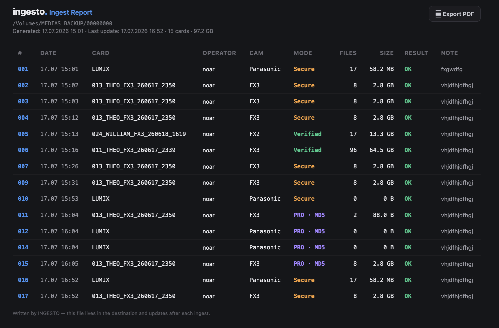

# ingesto
### Professional Camera Media Ingest — by Just Edit

Free, open-source ingest tool for video and audio professionals (DITs, camera
operators, editors) — copy footage off cards and drives to as many destinations
as you need, with every file read back and verified, camera auto-detection,
checksum lists, MHL and ASC MHL manifests, ingest reports, push notifications,
and a kiosk mode for on-set use.

Licensed under the **GNU General Public License v3.0** (see [`LICENSE`](./LICENSE)).
You're free to use, study, modify, and redistribute this software, as long as any
distributed modified version stays under the same license and its source is made
available. See the license file for the full terms.

macOS · Windows · Linux.

---



---

## What it does

- **Copies one card to several destinations at once**, then reads every
  destination back and compares fingerprints — the destinations are verified
  **at the same time**, not one after the other.
- **Tells you where every card is**, all the way through: one block per card,
  one line per destination, each with its own progress and its own throughput.
- **Refuses to start when something is wrong** rather than failing file by file
  — a drive that was unplugged after being loaded, two cards that would land in
  the same folder, a card with nothing on it.
- **Writes what it did**: an HTML/CSV/JSON report, checksum lists, MHL and
  ASC MHL v2.0 manifests, and a push notification per card.
- **Never claims more than it can prove.** A card that reported errors is never
  displayed as verified, and a run that copied nothing is never reported as a
  success.

---

## Screenshots

| Main window | Kiosk mode | Report |
|---|---|---|
|  |  |  |

---

## Quick install (no coding knowledge required)

### Step 1 — Install Node.js
1. Open your browser and go to **https://nodejs.org**
2. Click the green **"LTS"** button (recommended version)
3. Download and install the `.pkg` file
4. Follow the installer (click "Continue" through to the end)

### Step 2 — Download ingesto
Clone or download this repository (`Code` → `Download ZIP`, or
`git clone https://github.com/noar-justedit/ingesto.git`), and unzip it
wherever you like (e.g. your Desktop or `~/Documents`).

### Step 3 — Build the app
1. Open the `ingesto/scripts/` folder
2. **Double-click `build-mac.command`**
   - If macOS asks for confirmation, click **"Open"**
   - A Terminal window opens and builds everything automatically
   - The first run takes 2-3 minutes (downloading dependencies)
3. When it's done, the script offers to open the `dist/` folder

For Windows, use `scripts/build-win-from-mac.command` (cross-build from a Mac) —
the resulting installer is unsigned, so Windows will show a SmartScreen warning
on first launch (expected; click "More info" → "Run anyway").
For Linux, run `scripts/build-linux.sh` on a Linux machine.

Building for one platform never erases another platform's output: you can build
the Mac app and the Windows installer one after the other and keep both.

### Step 4 — Install the app
1. In the `dist/` folder, open the `.dmg` file
2. Drag **ingesto** into your **Applications** folder
3. **First launch**: right-click the app → **"Open"**
   (macOS will otherwise block it, since it isn't signed through the App Store)

---

## Test without building (dev mode)

If you just want to try it before building:
1. Install Node.js (see Step 1)
2. Double-click `scripts/dev.sh`

---

## Using the app

### Interface
- **Center column**: mounted volumes (SD cards, drives, network shares), each
  with a type icon (removable card, system disk, network, external) and an
  SRC/DST badge once assigned. During an ingest this column becomes the
  **ingest queue** — the volumes stay one click away, on the switch at the top
  right of the column.
- **Filters** (column header): hide System and/or Network volumes, or manually
  hide a given volume (right-click → Hide Volume)
- **Eject** (right-click a card or drive → **Eject**): unmounts it without
  leaving the app. Offered only for ejectable volumes — never the system disk or
  a network share — and refused while an ingest is running. If the volume was
  loaded as SOURCE or DESTINATION it is unloaded automatically, but only once
  the eject actually succeeded.
- **↻ Refresh**: refresh the volume list

### Typical workflow
1. **Connect** your source cards / drives
2. **Drag** a source volume into the **Sources** zone (left)
   — or right-click a volume → **Set as SOURCE**
3. **Drag** one or more destination drives into the **Destinations** zone (right)
4. Enter the **operator**, **camera model**, and notes if needed —
   globally, or per card
5. Choose a **copy mode** (below)
6. Configure the **folder name** using the variables (drag to reorder them)
7. Click **START INGEST**

You can load several cards at once. They are ingested one after the other, each
one to every destination.

### Copy modes

| Mode | What it does |
|---|---|
| **FAST** | Copy only, no checks |
| **VERIFIED** | Detects incomplete copies (size) |
| **SECURE** | Detects any data corruption — every file is read back from each destination and fingerprinted (xxHash64) |
| **PRO** | Secure, plus checksum lists and manifests, a choice of algorithm (xxHash64 / xxHash128 / MD5), and an optional **double source read** that re-reads the card itself to catch a card that is failing |

In SECURE and PRO the read-back genuinely goes to the disk — ingesto defeats the
operating system's cache before verifying, so a network destination is really
read over the network rather than out of memory.

### During the copy — the ingest queue

While a copy runs, the centre column shows the queue:

- a **ring for the whole queue**, weighted by bytes across every piece of work
  — the copy, one verification per destination, plus the source re-read when
  PRO has it on. A small card finishing no longer pushes the figure ahead of a
  large one still waiting.
- **one block per card**, each with its own ring and, in multi-destination, one
  nested line per destination carrying its own percentage and its own
  throughput. A drive falling behind the others is visible instead of being
  averaged away.
- a **bar that says which phase** by its colour — green copying, blue verifying,
  violet during the double source read, red on error.
- live figures under the header: current file, files and data remaining, speed
  with its throughput graph, time remaining (estimated per phase), errors.

**Pause** and **Cancel** stay available throughout. Everything else — the card
list, the destinations, the folder template, the counter, the copy mode — is
locked for the length of the run, and the values are captured when you press
Start, so nothing touched afterwards can reach a copy already in flight.

If files fail, a **re-copy** button redoes only those files, and shows the same
queue while it does it.

### Checksums and manifests

In PRO mode, and depending on your settings, ingesto writes alongside the
footage:

- a **checksum list** in the TeraCopy-compatible format
  (`.xxh` / `.xxh3` / `.md5`)
- a **classic MHL** manifest
- an **ASC MHL v2.0** history — an `ascmhl` folder holding a manifest and a
  chain file, in the format the DIT tools of the industry read. Every algorithm
  ingesto can produce is accepted, and re-copying failed files adds a
  generation rather than rewriting history. Fingerprints are recorded as
  `verified`, not `original`: every file in the list was read back from the
  destination and compared.

Nothing is fingerprinted twice — the manifests are written from the values
already computed during the ingest.

### Safety checks before an ingest starts

- **A drive that has gone.** Every card and every destination is checked the
  moment you press Start. Ejecting a destination after loading it and then
  starting used to run the whole ingest into errors; ingesto now refuses to
  begin, names the drive, and says nothing has been copied. The check also
  catches a folder that was a mount point and no longer is, and a different
  card mounted at the same place.
- **Two cards landing in the same folder.** With a template carrying no
  `{counter}` and two cards labelled the same — `NO NAME` is the factory label
  on half the cards in circulation — the second used to overwrite the first,
  with both runs reporting success. ingesto resolves every folder name before
  writing anything and refuses to start if two collide, naming the two cards.
- **A card with nothing to copy.** A run that copied no file at all is an error
  that says why — an empty folder, or a file filter that excluded everything —
  not a green summary.

### Notifications

With ntfy configured, ingesto sends **one complete message per card**: counter
number and card name, operator and camera, file count, volume and copy mode,
the source path, one line per destination with its own result, the copy /
verify / source re-read timings, the total duration, and the card note. A card
that failed is raised to high priority and names the destination that failed.

### Kiosk mode

A locked, full-screen view for a shared ingest station: one card, big type, a
ring that follows the whole queue, and an automatic eject when the footage is
verified. Leaving kiosk mode requires a PIN, which is never written to disk.

### Verifying a folder later
The **Verify** button (book icon) lets you re-check a folder that was already
ingested, by reading back its checksum list or MHL manifest, without copying
anything again.

---

## Folder name variables

| Variable | Description | Example |
|----------|-------------|---------|
| `{counter}` | Auto-incrementing counter | `001`, `002`… |
| `{cardname}` | Source volume name | `A001` |
| `{operator}` | Operator name entered | `JohnDoe` |
| `{camera}` | Camera model entered/detected | `SonyFX3` |
| `{YY}` | Short year | `26` |
| `{MM}` | Month | `04` |
| `{DD}` | Day | `29` |
| `{HH}` | Hour | `14` |
| `{MIN}` | Minutes | `35` |

`{cameraman}` is kept as a legacy alias of `{operator}`, so older templates
still load.

**Example**: `001_A001_JohnDoe_SonyFX3_260429_1435`

---

## Building and testing

```
npm install
npm start            # run from source
npm test             # engine test suite
npm run build        # macOS (Apple Silicon)
npm run build:win    # Windows installer, cross-built from a Mac
npm run build:linux  # Linux (run on Linux)
```

---

## Project structure

```
ingesto/
├── src/
│   ├── main/
│   │   ├── main.js            — Electron main process (copy engine, volumes, IPC…)
│   │   ├── camera-detect.js   — Camera brand/model detection from card structure
│   │   ├── sentinel.js        — Card tracking (.ingesto.json), off by default
│   │   ├── nocache.js         — Uncached read-back verification (macOS/Windows/Linux)
│   │   └── preload.js         — Secure bridge between main and renderer
│   └── renderer/
│       └── index.html         — Full user interface (HTML+CSS+JS)
├── build-resources/
│   ├── icon.icns / icon.ico   — Compiled app icons
│   └── entitlements.mac.plist
├── docs/
│   └── screenshots/            — Screenshots used in this README
├── scripts/
│   ├── build-mac.command      — Build the app for Mac
│   ├── build-win-from-mac.command — Build the Windows installer from a Mac
│   ├── build-linux.sh         — Build the app for Linux
│   ├── dev.sh                 — Run in dev mode, without building
│   └── test-*.js              — Engine test suites (run by `npm test`)
├── package.json                — Project configuration
├── LICENSE                     — Full text of the GPL v3 license
└── README.md                   — This file
```

---

## Troubleshooting

**"ingesto can't be opened because Apple cannot check it for malicious software"
/ "...because the developer cannot be verified" (macOS, first launch)**

ingesto isn't signed with an Apple Developer certificate, so macOS blocks it
on first launch. Two ways to fix it, either works — you only need to do this once:

- **Right-click method (easiest)**: right-click (or Control+click) ingesto in
  Applications → **Open** → **Open** again in the dialog that appears.
- **Terminal method**: open Terminal (Applications → Utilities → Terminal),
  paste the following, press Enter, then launch ingesto normally:
  ```
  xattr -cr /Applications/ingesto.app
  ```

**"build-mac.sh" won't open**
→ Terminal → `chmod +x /path/to/build-mac.sh && /path/to/build-mac.sh`

**Volumes aren't showing up**
→ Click **↻ Refresh**; check that your cards are actually mounted in Finder/Explorer

**Copying is slow in SECURE or PRO mode**
→ Expected — every file is read back from every destination and fingerprinted,
and the read deliberately bypasses the operating system's cache so that the
check is real. That's the trade-off between speed and integrity guarantees.

**An ingest refuses to start**
→ Read the message: it names what is wrong (a drive that is no longer there,
two cards that would land in the same folder, a card with nothing to copy) and
tells you that nothing has been copied.

---

## Contributing

Issues and pull requests are welcome on this repository. The maintainer remains
the sole decision-maker on what gets merged, but any genuine contribution will
be considered.

## License

This project is licensed under **GNU GPL v3.0**. See the [`LICENSE`](./LICENSE)
file for the full text. In short: you're free to use, study, modify, and
redistribute this software; any modified version you distribute must stay
under the same license, with its source code made available.

## Support

**ingesto** — [github.com/noar-justedit/ingesto](https://github.com/noar-justedit/ingesto)

For a bug report or feature request, open an *issue* on this repository:
[github.com/noar-justedit/ingesto/issues](https://github.com/noar-justedit/ingesto/issues)

Copyright © Just Edit — 2026
